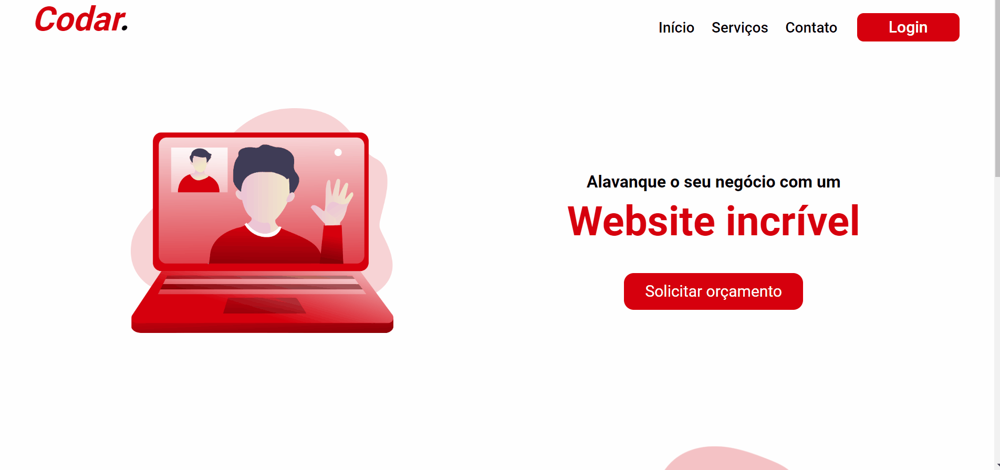
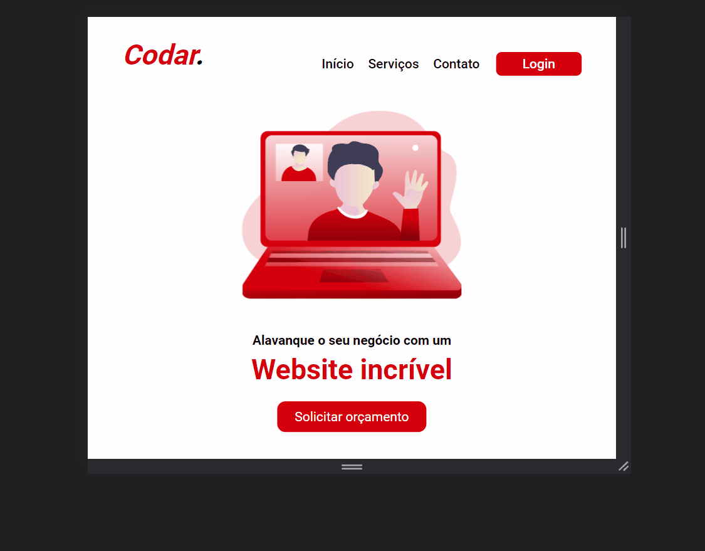
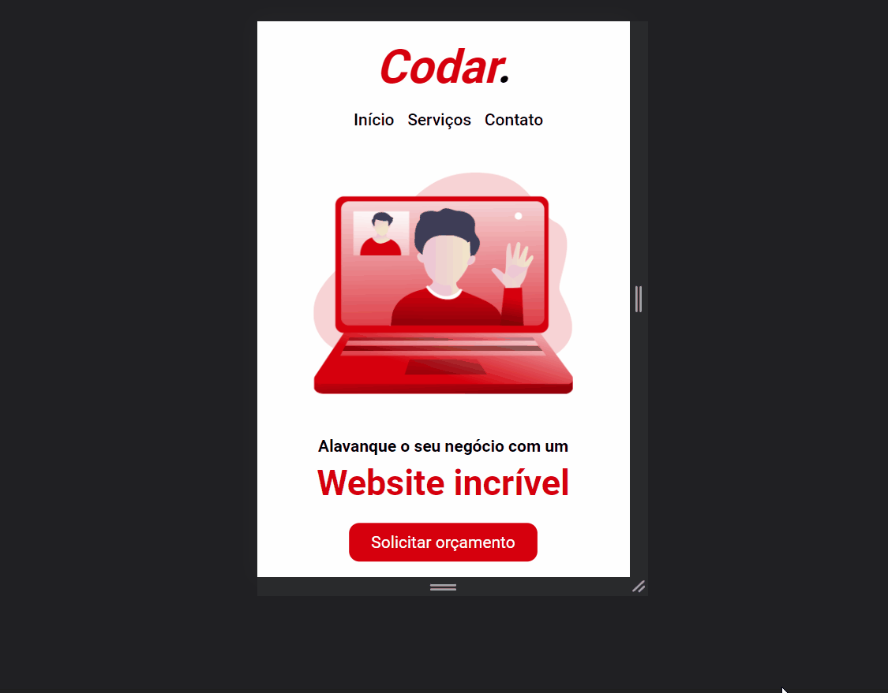

<h1>Codar</h1>

Este projeto tem por objetivo, a criação de uma página web responsiva utilizando conceitos de HTML e CSS intermediários. Para visualizar a página, clique <a href="https://patrick-adas.github.io/Codar/">aqui</a>

<h2>Tecnologias utilizadas.</h2>
<ul>
  <li>HTML : Estruturas semânticas, containers, listas e tags básicas</li>
  <li>CSS : Reset e normalize css, media queries, FlexBox, CSS intermediário, variáveis CSS, responsividade</li>
  <li>Git e Github : Commits, integração com repositório remoto, controle e versionamento de código</li>
</ul>
<h2>Pré-visualização</h2>

